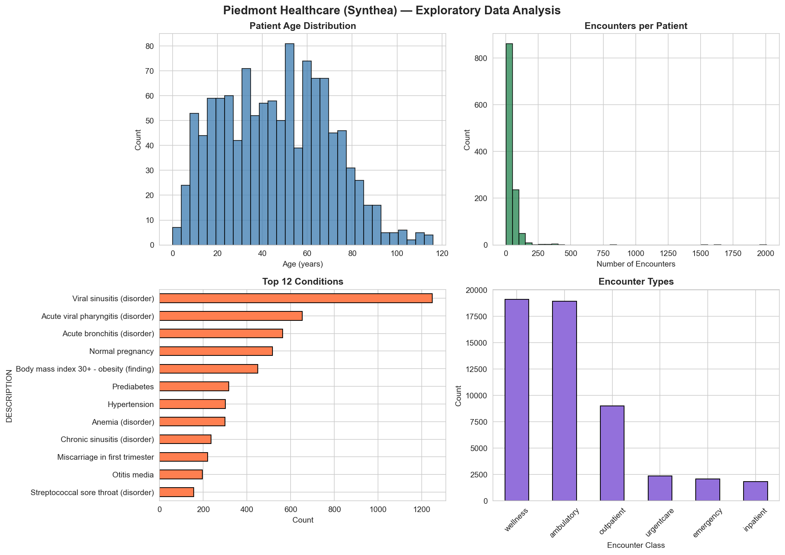
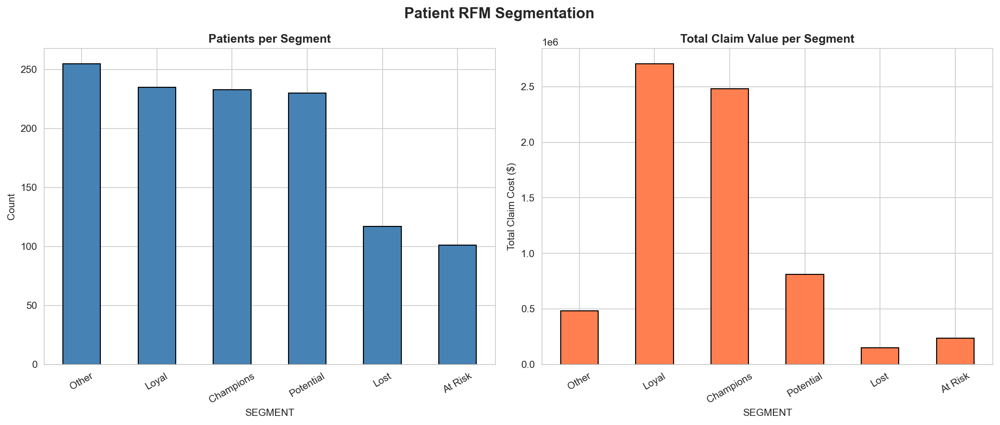
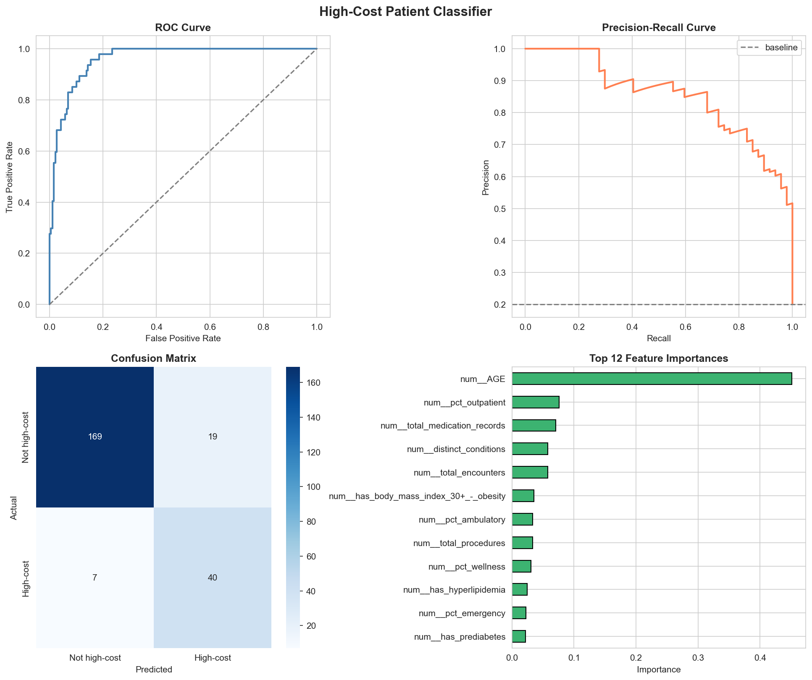
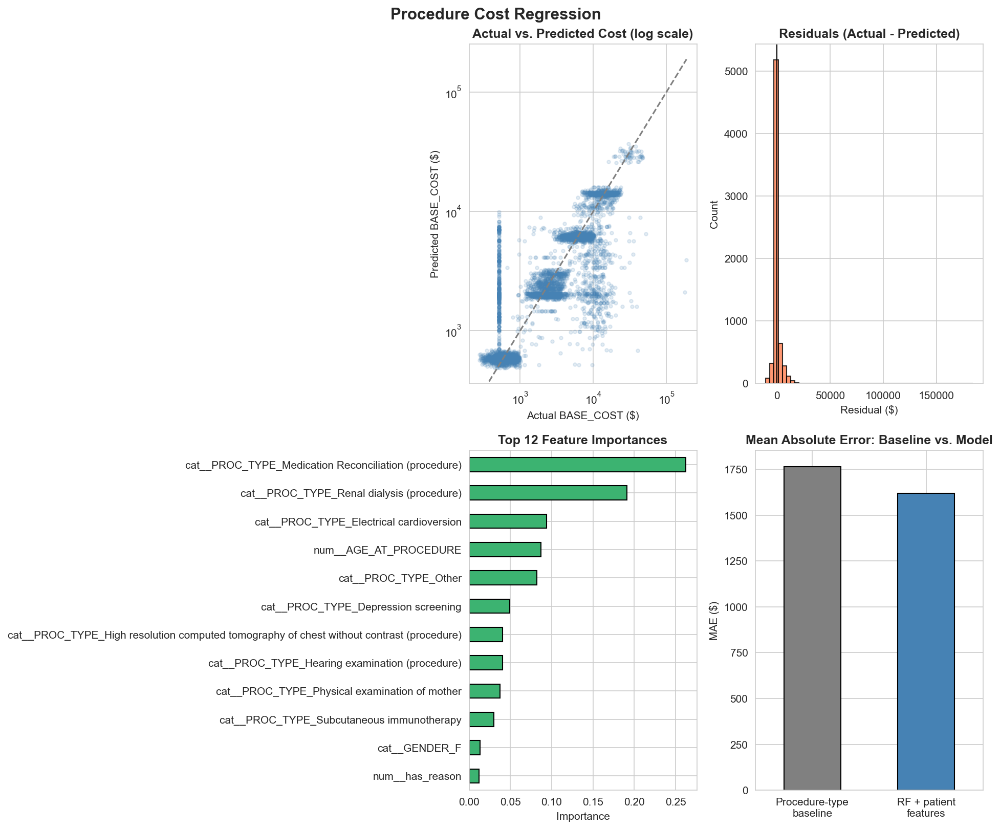

# Piedmont Healthcare Analysis — Patient Segmentation & Cost Prediction

An end-to-end analysis of real Synthea synthetic patient records: exploratory analysis,
RFM patient segmentation, a high-cost patient classifier, and a procedure cost regressor —
built as a local, script-based pipeline (no notebooks, no synthetic-data fabrication).

## Why this project

Most portfolio healthcare-analytics projects stop at a dashboard. This one is built the way
I'd want to defend it in an interview: every modeling decision is checked against a specific
failure mode before it's trusted — target leakage, feature circularity, group leakage across
train/test, and cherry-picked metrics — and the checks are documented inline, not just in my
head. The goal is a small set of models I can fully explain, not a large set I can't.

## Data

[Synthea](https://synthetichealth.github.io/synthea/) is an open-source synthetic patient
generator used widely for healthcare analytics demos and research — the records are
statistically realistic but not real people, so there are no PHI/privacy concerns.

This analysis uses the **real generated extract as-is**: 1,171 patients, 53,346 encounters,
8,376 conditions, 42,989 medication records, and 34,981 procedures. No synthetic/fabricated
records were added on top of it.

## Pipeline

```
piedmont_main.py
├── piedmont_eda.py               EDA: demographics, encounters, conditions, medications
├── piedmont_rfm.py                RFM segmentation (Recency / Frequency / Monetary)
├── piedmont_ml_highcost.py        Classifier: is this patient in the top 20% of lifetime cost?
└── piedmont_ml_procedure_cost.py  Regressor: what will this procedure cost?
```

Run the whole thing with:

```bash
pip install -r requirements.txt
python piedmont_main.py
```

Charts are written to `piedmont_output/`.

## Key findings

**Segmentation** — Champions + Loyal patients are 40% of the population but **76% of total
claim value** ($5.2M of $6.9M), a clear target for retention-focused care management.

**High-cost patient classification** — a Random Forest trained on utilization and clinical
signals *only* (encounter counts, condition flags, medication/procedure counts — never dollar
amounts) predicts which patients fall in the top 20% of lifetime healthcare expense:

| Metric | Score |
|---|---|
| ROC-AUC | 0.96 |
| PR-AUC | 0.854 (vs. 0.20 baseline) |
| Precision / Recall (high-cost class) | 0.68 / 0.85 |

*Caveat:* `AGE` accounts for ~45% of feature importance. This is expected, not a clinical
insight — Synthea's `HEALTHCARE_EXPENSES` field accumulates over a patient's whole life, so
older patients mechanically rack up more billing regardless of how complex their care is.

**Procedure cost regression** — a Random Forest predicts per-procedure cost (`BASE_COST`)
from procedure type and patient context, benchmarked against a procedure-type-only baseline:

| Model | MAE | R² |
|---|---|---|
| Procedure-type-only baseline | $1,765 | 0.513 |
| RF + patient features | $1,619 | 0.493 |

Patient context cuts typical-case error by 8.2%, but slightly *underperforms* the baseline on
extreme-cost outliers (lower R², which is squared-error weighted) — reported honestly rather
than picking whichever metric looks better.

## Charts






## Methodology notes (rigor checklist)

- **Leakage checked before modeling, not after**: verified `BASE_ENCOUNTER_COST` is
  identical to the target `TOTAL_CLAIM_COST` in every row, and that `TOTAL_CLAIM_COST`
  itself has almost no variance in this extract (mean $128.75, std $4.58) — both were
  excluded/avoided rather than silently degrading model quality.
- **No cost-derived features in the cost classifier** — it predicts high spend from care
  *utilization patterns*, not from other dollar fields, so the result isn't circular.
- **Patient-grouped train/test split** (`GroupShuffleSplit`) in the procedure cost model so
  a single patient's procedures never appear in both train and test.
- **Baseline comparison, not a bare R²** — every model is benchmarked against a naive
  baseline (class balance for the classifier, procedure-type group means for the
  regressor) so the reported lift is honest.

## Tech stack

Python · pandas · scikit-learn (RandomForestClassifier / RandomForestRegressor) ·
matplotlib · seaborn

## Next steps

- **Encounter-level seasonality** — condition rates (sinusitis, bronchitis) suggest a
  seasonal pattern worth quantifying against encounter volume over time.
- **Comorbidity association mining** — market-basket analysis on `conditions.csv` to find
  which conditions co-occur, beyond the top-15 frequency list in the EDA.
- **Calibration check on the high-cost classifier** — confirm predicted probabilities are
  well-calibrated (not just well-ranked) before using them for a resource-allocation cutoff.

## Project structure

```
piedmont_config.py             paths & constants
piedmont_data_loader.py        loads real Synthea CSVs with correct dtypes
piedmont_eda.py                exploratory analysis + chart
piedmont_rfm.py                RFM segmentation + chart
piedmont_ml_highcost.py        high-cost patient classifier + chart
piedmont_ml_procedure_cost.py  procedure cost regressor + chart
piedmont_main.py               runs the full pipeline end-to-end
piedmont_output/               generated charts (PNG)
```
